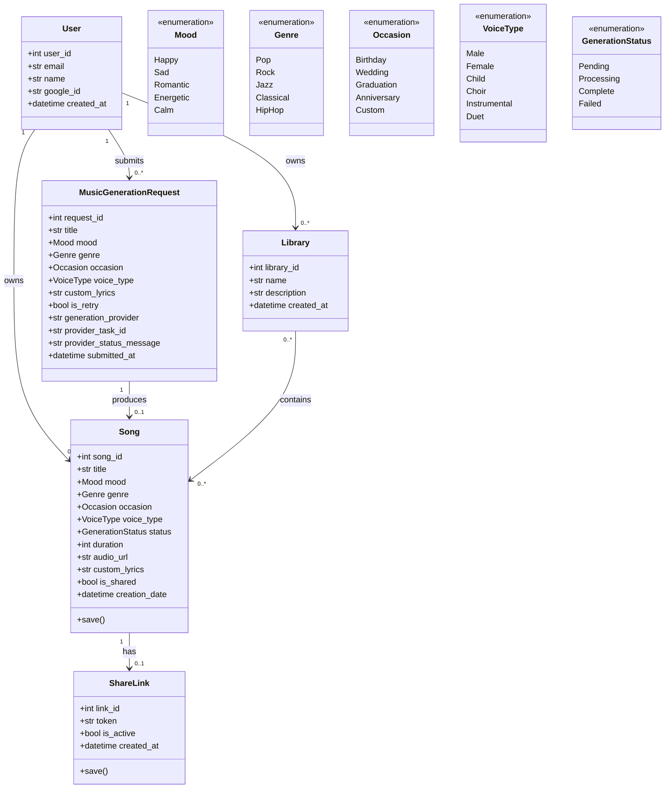
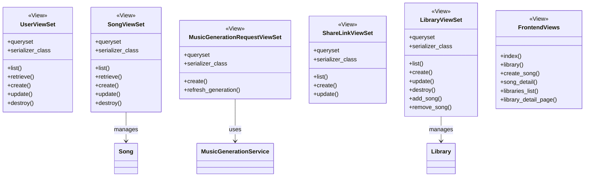
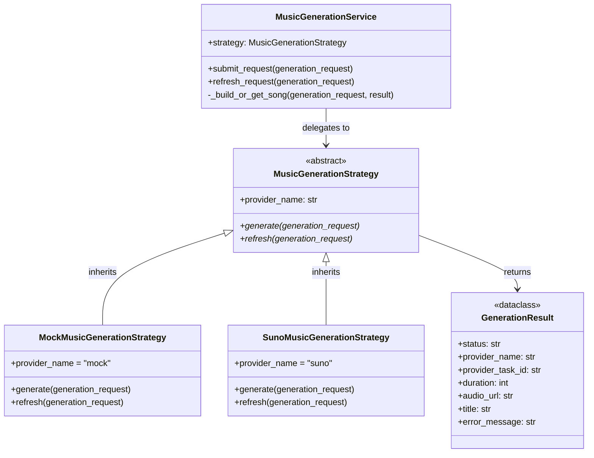
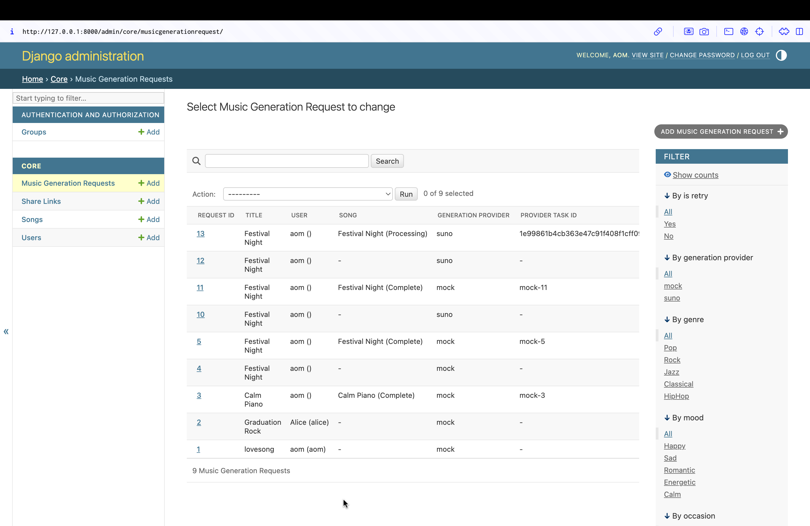
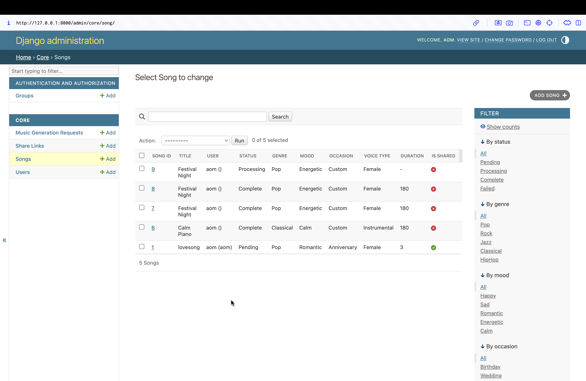

# Cithai — AI Music Generation Platform
The AI Music Generator is a web-based application that lets users create original music from text descriptions using artificial intelligence.
---

## Quick Start

### 1. Clone repository

```bash
git clone https://github.com/Natcha-limsuwan/Cithai.git
cd Cithai
```

### 2. Create and activate virtual environment

```bash
python3 -m venv venv
source venv/bin/activate
```

### 3. Install dependencies

```bash
pip install -r requirements.txt
```

### 4. Configure environment variables

Copy the provided template and fill in your values:

```bash
cp .env.example .env
```

Open `.env` and set the variables you need. For local development with the mock
strategy you only need the defaults — no API key is required:

```
GENERATOR_STRATEGY=mock
```

To use the real Suno API, set:

```
GENERATOR_STRATEGY=suno
SUNO_API_KEY=your_key_here
```

To enable **Google OAuth** (required for the "Sign in with Google" button):

1. Go to [Google Cloud Console](https://console.cloud.google.com/) → create a project
2. Navigate to **APIs & Services → Credentials → Create Credentials → OAuth 2.0 Client ID**
3. Application type: **Web application**
4. Add `http://127.0.0.1:8000/auth/google/callback/` under **Authorized redirect URIs**
5. Copy the Client ID and Client Secret into `.env`:

```
GOOGLE_CLIENT_ID=your-client-id.apps.googleusercontent.com
GOOGLE_CLIENT_SECRET=your-client-secret
GOOGLE_REDIRECT_URI=http://127.0.0.1:8000/auth/google/callback/
```

> Without Google credentials, use the **"Dev login"** option on the sign-in page to log in locally.

> **Important:** `.env` is listed in `.gitignore`. Never commit it to the repository.
> `.env.example` (committed) shows every variable and its purpose — it contains
> no real secrets.

### 5. Apply migrations

```bash
python3 manage.py migrate
```

### 6. Seed demo data

```bash
python3 manage.py seed_data
```

### 7. Create an admin superuser

```bash
python3 manage.py createsuperuser
```

When prompted for a password you can leave it blank (Google OAuth is used in
production — no passwords are stored).

### 8. Run the development server

```bash
python3 manage.py runserver
```

Open http://127.0.0.1:8000/

---

## Key URLs

### Frontend Pages

| URL | Description |
|-----|-------------|
| `/` | Login / landing page |
| `/library/` | My Songs — list all songs for the logged-in user |
| `/create/` | Create a new song |
| `/songs/<id>/` | Song detail — player, share, delete |
| `/libraries/` | Libraries list — manage song collections |
| `/libraries/<id>/` | Library detail — songs inside a collection |

### REST API

| URL | Description |
|-----|-------------|
| `/admin/` | Django Admin — full CRUD for all entities |
| `/api/` | Browsable REST API root |
| `/api/users/` | User CRUD |
| `/api/songs/` | Song CRUD |
| `/api/requests/` | MusicGenerationRequest CRUD |
| `/api/requests/<id>/refresh_generation/` | Poll generation status from the active provider |
| `/api/shares/` | ShareLink CRUD |
| `/api/libraries/` | Library CRUD |
| `/api/libraries/<id>/add_song/` | Add a song to a library |
| `/api/libraries/<id>/remove_song/` | Remove a song from a library |


---

## Domain Entities

| Model | Maps to domain concept |
|-------|------------------------|
| `User` | Authenticated person, Google OAuth identity |
| `Song` | Central entity — stores metadata & generation status |
| `MusicGenerationRequest` | Input data submitted by user; preserved on failure |
| `ShareLink` | Unique token URL for authenticated sharing |
| `Library` | User-defined collection of songs (M2M with Song) |

**Enumerations (fixed at design time — A-6):**
`Mood`, `Genre`, `Occasion`, `VoiceType`, `GenerationStatus`

---

## Class Diagram

The diagram is organized by the **MVT (Model–View–Template)** layers that Django uses.

### Model Layer — Domain Entities



### View Layer — API & Frontend Views



### Service Layer — Strategy Pattern



---

## Architecture (MVT Pattern)

The application follows Django's **Model–View–Template (MVT)** pattern:

| Layer | Location | Responsibility |
|-------|----------|---------------|
| **Model** | `core/models/` | Domain entities, business rules (C-1 to C-4), constraints |
| **View** | `core/views.py` | REST API endpoints (DRF ModelViewSet); `core/frontend_views.py` renders templates |
| **Template** | `core/templates/` | HTML pages served to the browser; call REST API via JavaScript |

Static files (`core/static/`) contain `style.css` and `cithai.js` — the JS layer fetches data from the REST API and renders it on the client side.

---

## Sequence Diagram — Song Generation Use Case

```
User         Browser (Template)      REST API (View)       Strategy (Service)     Provider
 |                  |                       |                      |                  |
 |  Fill form &     |                       |                      |                  |
 |  click Generate  |                       |                      |                  |
 |----------------->|                       |                      |                  |
 |                  | POST /api/requests/   |                      |                  |
 |                  |---------------------->|                      |                  |
 |                  |                       | serializer.save()    |                  |
 |                  |                       | set generation_      |                  |
 |                  |                       | provider = SETTING   |                  |
 |                  |                       |--------------------->|                  |
 |                  |                       |                      | factory selects  |
 |                  |                       |                      | Mock or Suno     |
 |                  |                       |                      |----------------->|
 |                  |                       |                      |  [mock] create   |
 |                  |                       |                      |  Song instantly  |
 |                  |                       |                      |  status=Complete |
 |                  |                       |                      |<-----------------|
 |                  |                       |                      |  [suno] POST     |
 |                  |                       |                      |  /generate       |
 |                  |                       |                      |  → taskId stored |
 |                  |                       |                      |<-----------------|
 |                  |                       |<---------------------|                  |
 |                  |<----------------------|                      |                  |
 |                  | redirect /library/    |                      |                  |
 |                  |                       |                      |                  |
 |  [Suno only] auto-refresh every 6s       |                      |                  |
 |                  | POST /api/requests/   |                      |                  |
 |                  | <id>/refresh_         |                      |                  |
 |                  | generation/           |                      |                  |
 |                  |---------------------->|                      |                  |
 |                  |                       | use stored provider  |                  |
 |                  |                       |--------------------->|                  |
 |                  |                       |                      | GET /generate/   |
 |                  |                       |                      | record-info      |
 |                  |                       |                      |----------------->|
 |                  |                       |                      |<-----------------|
 |                  |                       |                      | map status →     |
 |                  |                       |                      | Processing /     |
 |                  |                       |                      | Complete / Failed|
 |                  |                       |<---------------------|                  |
 |                  |<----------------------|                      |                  |
 |  Song status     |                       |                      |                  |
 |  updates on page |                       |                      |                  |
```

---

## Business Rules Enforced

| Rule | Where enforced |
|------|---------------|
| C-1 Song belongs to exactly one User | ForeignKey with CASCADE |
| C-2 Max 20 songs per User | `Song.save()` + serializer validation |
| C-3 `is_shared = false` by default | model field `default=False` |
| C-4 ShareLink only for Complete songs | `ShareLink.save()` + serializer validation |
| A-1 No passwords stored | `set_unusable_password()` in UserManager |
| A-2 One Request → at most one Song | OneToOneField on MusicGenerationRequest.song |
| A-4 ShareLink is optional (0..1) | OneToOneField, nullable |
| A-5 Only Complete songs can be shared | same as C-4 |
| A-7 Audio stored externally | No file field; only metadata in DB |

---

## REST API — Example Requests

```bash
# Create a generation request
curl -X POST http://127.0.0.1:8000/api/requests/ \
  -H "Content-Type: application/json" \
  -d '{"user":1,"title":"Calm Piano","custom_lyrics":"","mood":"Calm","genre":"Classical",
       "occasion":"Custom","voice_type":"Instrumental"}'

# Refresh provider status for a submitted request
curl -X POST http://127.0.0.1:8000/api/requests/1/refresh_generation/

# List all songs
curl http://127.0.0.1:8000/api/songs/

# Create a song
curl -X POST http://127.0.0.1:8000/api/songs/ \
  -H "Content-Type: application/json" \
  -d '{"user":1,"title":"Chill Vibes","mood":"Calm","genre":"Jazz",
       "occasion":"Anniversary","voice_type":"Instrumental","status":"Pending"}'

# Update status
curl -X PATCH http://127.0.0.1:8000/api/songs/1/ \
  -H "Content-Type: application/json" \
  -d '{"status":"Complete"}'

# Delete
curl -X DELETE http://127.0.0.1:8000/api/songs/1/

# Create a library
curl -X POST http://127.0.0.1:8000/api/libraries/ \
  -H "Content-Type: application/json" \
  -d '{"user":1,"name":"Favourites","description":"My best songs"}'

# Add a song to a library
curl -X POST http://127.0.0.1:8000/api/libraries/1/add_song/ \
  -H "Content-Type: application/json" \
  -d '{"song_id":1}'
```

---

## Project Structure

```
Cithai/
├── cithai/
│   ├── settings.py             # Project settings; GENERATOR_STRATEGY env var
│   └── urls.py                 # Root URL conf: frontend + API routes
├── core/
│   ├── models/
│   │   ├── __init__.py         # Re-exports all models & enums
│   │   ├── enums.py            # Mood, Genre, Occasion, VoiceType, GenerationStatus
│   │   ├── user.py             # User model + UserManager
│   │   ├── song.py             # Song model (C-1, C-2 enforced)
│   │   ├── music_generation_request.py
│   │   ├── share_link.py       # ShareLink model (C-3, C-4 enforced)
│   │   └── library.py          # Library model (M2M with Song)
│   ├── services/
│   │   └── music_generation/
│   │       ├── base.py         # Strategy interface + GenerationResult dataclass
│   │       ├── factory.py      # Centralized strategy selector
│   │       ├── service.py      # MusicGenerationService (context object)
│   │       ├── mock_strategy.py
│   │       └── suno_strategy.py
│   ├── templates/
│   │   ├── base.html           # Shared layout, loads CSS + cithai.js
│   │   ├── index.html          # Login / landing page
│   │   ├── oauth_success.html  # Post-OAuth redirect; passes user data to JS
│   │   ├── library.html        # My Songs grid
│   │   ├── create.html         # New song form
│   │   ├── song_detail.html    # Song player + share + delete
│   │   ├── libraries.html      # Libraries list
│   │   └── library_detail_page.html
│   ├── static/
│   │   ├── css/style.css       # Full blue-palette stylesheet
│   │   └── js/cithai.js        # API client, auth helpers, UI utilities
│   ├── serializers.py          # DRF serializers with constraint validation
│   ├── views.py                # ModelViewSet API endpoints
│   ├── frontend_views.py       # Thin views that render HTML templates
│   ├── oauth_views.py          # Google OAuth login & callback handlers
│   ├── admin.py                # Django Admin registration
│   ├── tests.py                # Unit + integration tests
│   └── management/
│       └── commands/
│           └── seed_data.py
├── manage.py
├── README.md
├── db.sqlite3                  # SQLite database (dev only)
├── DomainModeling.png
├── requirements.txt
└── .gitignore
```


### View CRUD screenshots: 
 [CRUD folder](./CRUD/)

---

## Strategy Pattern: Mock vs Suno

The app now uses a provider strategy to process `MusicGenerationRequest` submissions.

- `mock`: creates a completed local song instantly for demos and testing
- `suno`: submits the request to Suno's `POST /api/v1/generate` endpoint and refreshes status with `GET /api/v1/generate/record-info`

### Strategy Interface

The common strategy interface lives in `core/services/music_generation/base.py` and exposes:

- `generate(request) -> result`
- `refresh(request) -> result`

### Run In Mock Mode

```bash
export GENERATOR_STRATEGY=mock
python3 manage.py runserver
```

Submit a request:

```bash
curl -X POST http://127.0.0.1:8000/api/requests/ \
  -H "Content-Type: application/json" \
  -d '{"user":1,"title":"Calm Piano","custom_lyrics":"","mood":"Calm","genre":"Classical",
       "occasion":"Custom","voice_type":"Instrumental"}'
```

Example mock result:

```json
{
  "request_id": 1,
  "song": 1,
  "generation_provider": "mock",
  "provider_task_id": "mock-1",
  "provider_status_message": ""
}
```

### Run In Suno Mode

```bash
export GENERATOR_STRATEGY=suno
export SUNO_API_KEY=your_token_here
export SUNO_API_BASE_URL=https://api.sunoapi.org/api/v1
export SUNO_CALLBACK_URL=https://example.com/api/suno/callback
export SUNO_MODEL=V4_5ALL
python3 manage.py runserver
```

`SUNO_API_KEY` must be provided through environment variables and must not be committed to the repository. Do not hard-code it in `settings.py`, `.env`, screenshots, or Git history.

Create the Suno generation task:

```bash
curl -X POST http://127.0.0.1:8000/api/requests/ \
  -H "Content-Type: application/json" \
  -d '{"user":1,"title":"Festival Night","custom_lyrics":"Shine through the city lights",
       "mood":"Energetic","genre":"Pop","occasion":"Custom","voice_type":"Female"}'
```

Expected Suno result when the provider accepts the request:

```json
{
  "request_id": 2,
  "song": null,
  "generation_provider": "suno",
  "provider_task_id": "5c79xxxxbe8e",
  "provider_status_message": ""
}
```

Check the task later with polling:

```bash
curl -X POST http://127.0.0.1:8000/api/requests/2/refresh_generation/
```

Expected refreshed Suno result after polling:

```json
{
  "request_id": 2,
  "song": 2,
  "generation_provider": "suno",
  "provider_task_id": "5c79xxxxbe8e",
  "provider_status_message": ""
}
```

The linked `Song` record stores the mapped generation status:

- `PENDING`, `TEXT_SUCCESS`, `FIRST_SUCCESS` -> `Processing`
- `SUCCESS` -> `Complete`
- other Suno failure states -> `Failed`

### Centralized Selection

Strategy selection is centralized in `core/services/music_generation/factory.py`, so the rest of the code does not need scattered provider-specific `if/else` logic.

## Evidence of Usage

This section documents both strategies using commands, API responses, and screenshots captured from the local Django admin / DRF interface.

### Mock Mode Evidence

Mock mode runs completely offline and creates a `Song` immediately with deterministic metadata.

Command used:

```bash
export GENERATOR_STRATEGY=mock
python3 manage.py runserver

curl -X POST http://127.0.0.1:8000/api/requests/ \
  -H "Content-Type: application/json" \
  -d '{"user":1,"title":"Festival Night","custom_lyrics":"Shine through the city lights",
       "mood":"Energetic","genre":"Pop","occasion":"Custom","voice_type":"Female"}'
```

Observed mock output:

```json
{
  "request_id": 5,
  "user": 1,
  "song": 7,
  "title": "Festival Night",
  "custom_lyrics": "Shine through the city lights",
  "occasion": "Custom",
  "genre": "Pop",
  "voice_type": "Female",
  "mood": "Energetic",
  "is_retry": false,
  "generation_provider": "mock",
  "provider_task_id": "mock-5",
  "provider_status_message": ""
}
```

What this proves:

- The centralized selector activated the mock strategy.
- A linked `Song` record was created successfully.
- Mock generation works without external network access.

Suggested screenshot to submit:

- Django admin `Songs` page showing `Festival Night` with status `Complete`.

### Suno Mode Evidence

Suno mode uses the same `MusicGenerationRequest` entry point, but the active strategy is switched to `suno` through environment variables.

Command used:

```bash
export GENERATOR_STRATEGY=suno
export SUNO_API_KEY=your_real_key
export SUNO_API_BASE_URL=https://api.sunoapi.org/api/v1
export SUNO_CALLBACK_URL=https://example.com/api/suno/callback
export SUNO_MODEL=V4_5ALL
python3 manage.py runserver

curl -X POST http://127.0.0.1:8000/api/requests/ \
  -H "Content-Type: application/json" \
  -d '{"user":1,"title":"Festival Night","custom_lyrics":"Shine through the city lights",
       "mood":"Energetic","genre":"Pop","occasion":"Custom","voice_type":"Female"}'
```

Observed Suno request creation output:

```json
{
  "request_id": 14,
  "user": 1,
  "song": 10,
  "title": "Festival Night",
  "custom_lyrics": "Shine through the city lights",
  "occasion": "Custom",
  "genre": "Pop",
  "voice_type": "Female",
  "mood": "Energetic",
  "is_retry": false,
  "generation_provider": "suno",
  "provider_task_id": "0202c8733d615ee6a88943b3e9f5beac",
  "provider_status_message": ""
}
```

What this proves:

- The centralized selector activated the Suno strategy correctly.
- The application executed the Suno integration path instead of falling back to mock mode.
- Suno accepted the request and returned a real `taskId`.
- The request was linked to a `Song` record for later tracking.

Screenshots included in this repository:



Figure 1. `MusicGenerationRequest` in Django admin showing a successful Suno request with `generation_provider = suno`, a linked song, and a real `provider_task_id`.



Figure 2. `Song` in Django admin showing the linked Suno-generated song updated to `Processing`.

### Notes On Suno Task IDs And Polling

When Suno accepts a request successfully, the API returns a `taskId`. That value is stored in `provider_task_id`, and the app can poll details with:

```bash
curl -i -X POST http://127.0.0.1:8000/api/requests/14/refresh_generation/
```

Observed polling result for the successful Suno request:

```http
HTTP/1.1 200 OK
```

```json
{
  "request_id": 14,
  "user": 1,
  "song": 10,
  "title": "Festival Night",
  "custom_lyrics": "Shine through the city lights",
  "occasion": "Custom",
  "genre": "Pop",
  "voice_type": "Female",
  "mood": "Energetic",
  "is_retry": false,
  "generation_provider": "suno",
  "provider_task_id": "0202c8733d615ee6a88943b3e9f5beac",
  "provider_status_message": ""
}
```

This confirms that the app can retrieve status/details for a previously submitted Suno generation request. The polling code path is implemented in `core/services/music_generation/suno_strategy.py`.

